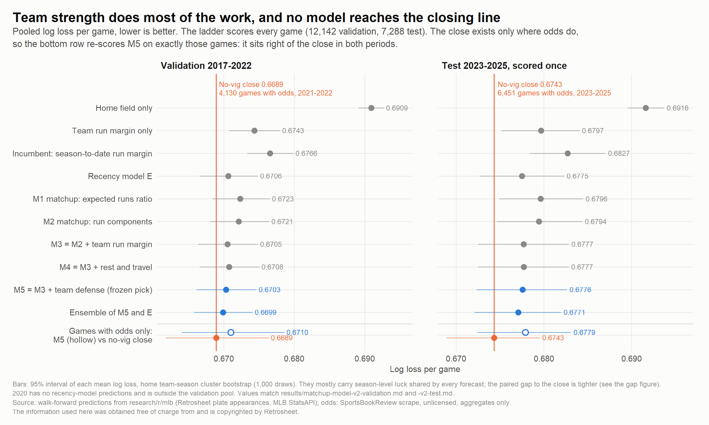
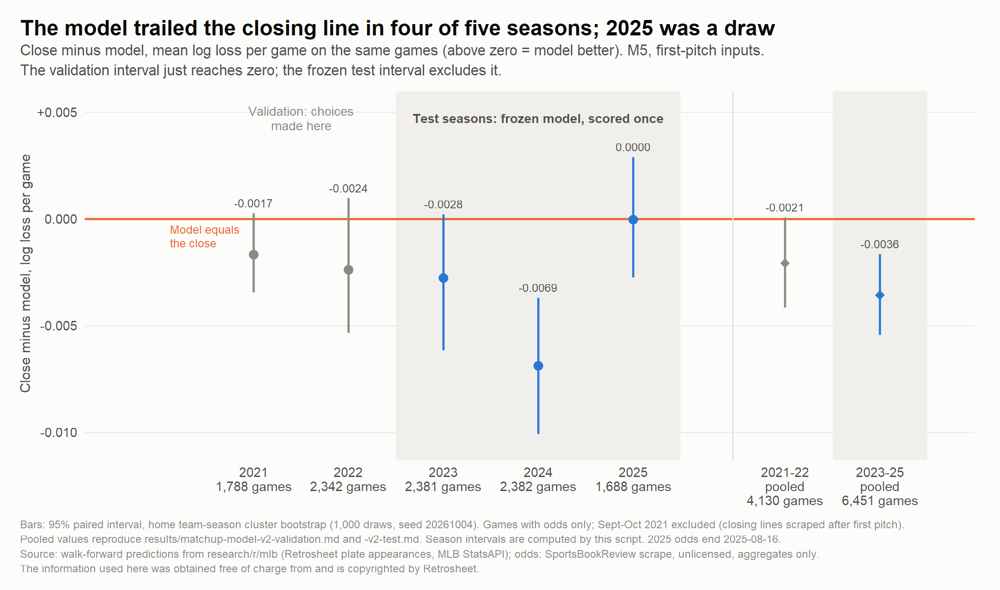
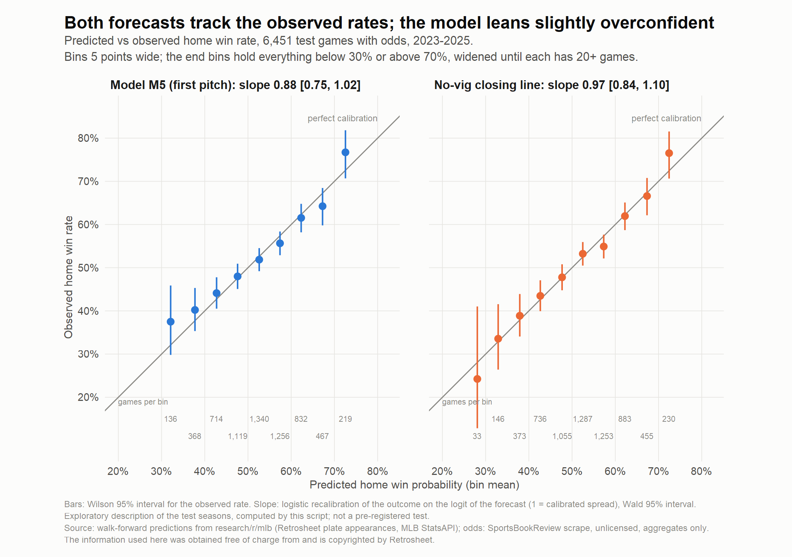
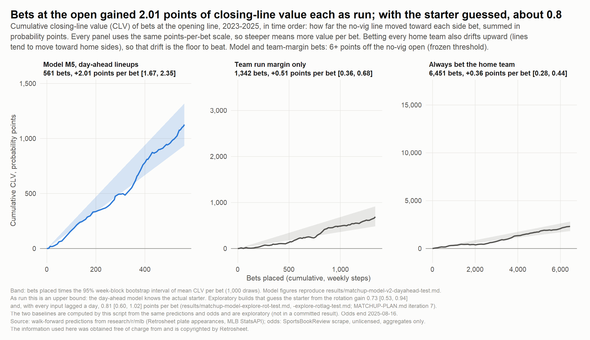
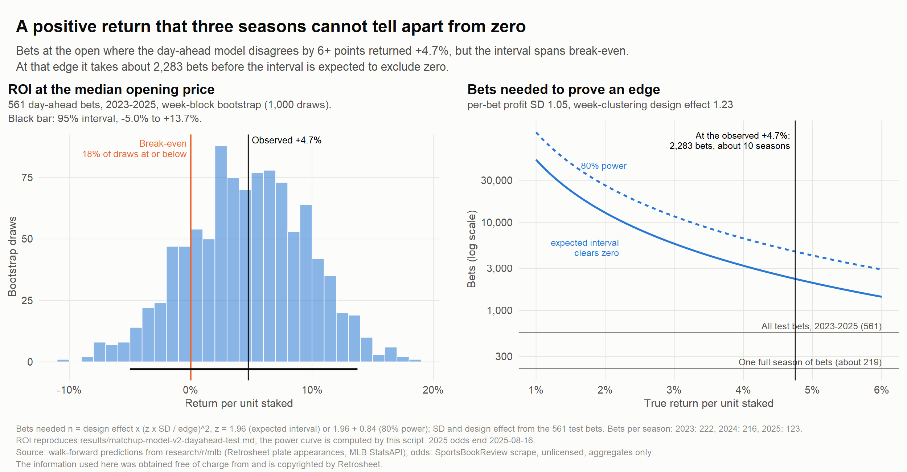
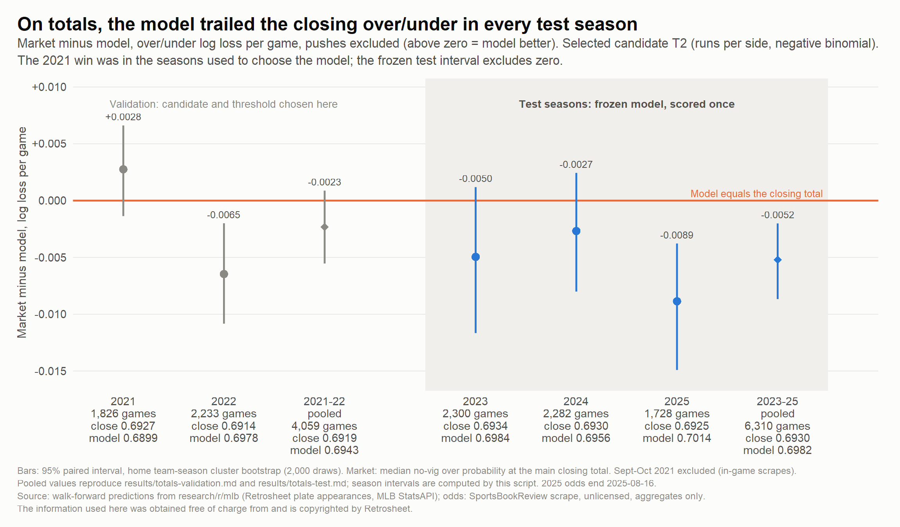
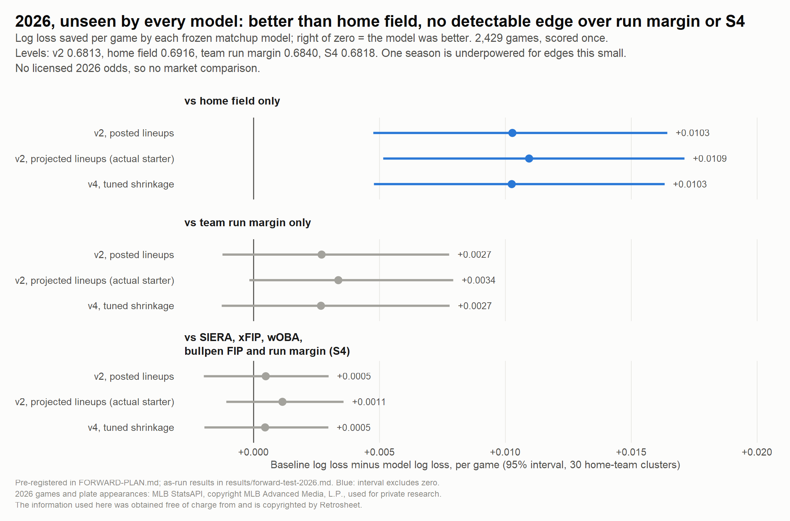
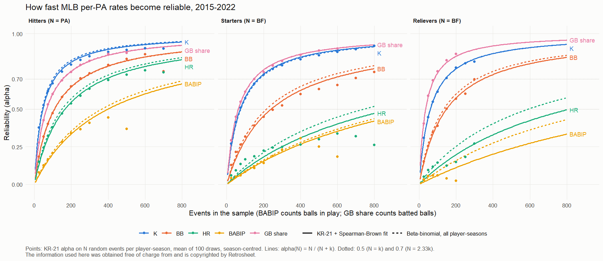

# Can a public-data model beat Vegas, game by game?

**No.** Scored once on 6,451 games from 2023 to 2025, the frozen model's log loss was 0.0036 per
game worse than the no-vig closing line (95% interval 0.0016 to 0.0054). A later check found 12
dates whose scraped "closing" lines were taken after first pitch; without them the gap halves to
0.0018 [0.0001, 0.0036] on 6,436 games, still in the close's favor (`results/close-timing.md`). Its bets at the opening
line did see where the market was going, gaining 2.01 probability points of closing-line value per
bet [1.67, 2.35] on 561 bets. With MLB's listed probable starters in place of the actual ones it
stays at 1.97, but it remains an upper bound, because the opening line carries no timestamp. The return those bets earned, +4.7% [-5.0%, +13.7%], cannot be told apart from
zero, and about ten seasons of bets would be needed before it could.

A second holdout, the 2026 season, was scored once on outcomes only. The model beat home field by
0.0103 per game [0.0048, 0.0164], but it was not detectably better than team run margin alone or
than a conventional model built from SIERA, xFIP, wOBA, bullpen FIP and run margin. One season is
too short to see edges that small (about 14% to 16% power for the edges measured earlier), so this is a
weak test, not evidence of a tie. No licensed 2026 odds were available, so 2026 says nothing about
the market.

| | What was asked | Result on the frozen 2023-2025 test, as run | After the odds-join fix | Plus the closing-time fix | Verdict under the pre-registered rule |
|---|---|---|---|---|---|
| Forecast | Does the model predict winners as well as the closing line? | Trails by 0.0036 [0.0016, 0.0054] on 6,451 games | Trails by 0.0035 [0.0017, 0.0055] on 6,576 games | Trails by 0.0018 [0.0001, 0.0036] on 6,436 games | Does not match the close |
| Money at the close | Do bets at closing prices make money? | 965 bets, -4.4% [-12.6%, +4.2%] | 988 bets, -4.6% [-12.6%, +4.0%] | 907 bets, +0.5% [-6.4%, +8.0%] | Not profitable |
| Skill at the open | Do bets at the opening line beat the close? | 561 bets, +2.01 points [1.67, 2.35] | 573 bets, +2.01 points [1.67, 2.36] | 561 bets, +1.94 points [1.62, 2.26] | Passes (an upper bound; see Limits) |
| Money at the open | Do those bets make money? | +4.7% [-5.0%, +13.7%] | +4.6% [-5.2%, +13.6%] | +4.5% [-5.4%, +13.7%] | Not profitable (interval spans zero) |
| Totals | Does a run model beat the closing over/under? | Trails by 0.0052 [0.0020, 0.0087] | Not affected | Trails by 0.0061 [0.0027, 0.0097] on 6,171 games | Does not beat the closing total |

The closing-time fix drops 12 dates (2022-06-14, 2024-05-15, 2024-06-17, 2024-07-31 to 2024-08-07,
2025-08-12) whose "closing" lines moved over three times the season's typical daily amount, a rule
committed before it was scored (`MATCHUP-PLAN.md`). It is a post hoc data-quality correction, shown
beside the as-run numbers, and no verdict moves.

| 2026 forward test, 2,429 games, scored once | Log loss saved per game by the model [95%] | Verdict |
|---|---|---|
| vs home field only | +0.0103 [+0.0048, +0.0164] | Better |
| vs team run margin only | +0.0027 [-0.0012, +0.0078] | Not detectably better (underpowered) |
| vs conventional sabermetric model S4 | +0.0005 [-0.0020, +0.0030] | Not detectably better (underpowered) |
| vs tuned-shrinkage variant v4 | +0.00003 [-0.00012, +0.00018] | Tie; the model stays the default |

Sources: `results/matchup-model-v2-test.md`, `results/matchup-model-v2-dayahead-test.md`,
`results/totals-test.md`, the `-joinfix-test.md` files beside them, and
`results/forward-test-2026.md`. Private research on scraped odds; not betting advice.

## The question

Can a model built only from free, public data (Retrosheet play-by-play and MLB's StatsAPI) put a
better probability on each MLB regular-season game than the sportsbooks do? The fair comparison is
the closing moneyline with the bookmaker's margin removed (the "no-vig close"): it is set at first
pitch and carries everything the market has learned, which makes it the hardest benchmark in hand. The prior going in was that matching it would already be a strong
result, and a null result would be reported as an answer, not hidden.

Two secondary questions follow from it. If a model cannot beat the close, does it at least see
information early, so that its bets at the opening line move in its favour before first pitch
(closing-line value)? And does any of it turn into money once the bookmaker's margin is paid?

Three follow-ups came out of the first answer. Would the stats an analyst reaches for first (ERA,
FIP, SIERA, OPS, wOBA, handedness splits) do as well? Does simulating each game plate appearance by
plate appearance, with the bullpen that is actually available, add anything? And how much data does
each rate need before it can be trusted?

**How to read the numbers.** Log loss is the penalty a forecast pays for being confident and
wrong; lower is better, and a coin flip scores 0.6931 (`results/backtest-2019.md`). Single
baseball games are close to coin flips, so the whole range between "home team always" and the
betting market spans only about 0.02. A gap of 0.0036 (on the 6,451 games with odds) sounds tiny;
on this scale it is about a quarter of everything the best model gains over home field on all
7,288 test games (0.0145).

## The data

| Source | What it gives | Coverage used |
|---|---|---|
| Retrosheet play-by-play | Every regular-season plate appearance: batter, pitcher, hands, outcome, batted-ball type, park | 2015-2025 |
| MLB StatsAPI (key-free) | Schedules, posted lineups, starters, venues, game logs | 2015-2025 |
| MLB StatsAPI live feeds | The 2026 season in Retrosheet's shape: 2,429 games, 183,304 plate appearances | 2026 |
| Statcast batted balls | Exit velocity and launch angle, 1,282,277 balls, 97.8% matched to Retrosheet | 2015-2025 (tested, dropped) |
| Odds: SportsBookReview scrape (`ArnavSaraogi/mlb-odds-scraper`) | Opening and closing moneylines and totals from FanDuel, DraftKings, Bet365 and others | 2021-03-20 to 2025-08-16 |

Retrosheet had not released 2026 when it was scored, so 2026 comes from StatsAPI. Run on 2025, the
StatsAPI adapter matches Retrosheet on 100% of scores, plate-appearance counts and outcomes
(`results/statsapi-parity-2025.md`).

Odds matched 10,583 games as first run, 91.5% of model games in the odds window, with an average
closing overround of 1.044 and 5.6 books per game (`results/market-study.md`). A later check found
that the odds file names 2021 Cleveland "Guardians" and the 2025 A's "Athletics Athletics", so 248
games never joined; with both names mapped the join reaches 10,831 games
(`results/market-study-joinfix.md`). Both versions are published and no verdict moved. September
and October 2021 are excluded: their "closing" lines were scraped after first pitch (36% moved more
than 15 points from the open), which a sanity check caught on the first run (`MARKET-PLAN.md`,
iteration 2). That check was monthly, and a later review found shorter windows it missed. A daily
rule, committed before scoring, flags any date with at least 5 games whose mean open-to-close move
is over three times its season's median day: 12 dates, 8 of them 2024-07-31 to 2024-08-07. On those
dates the "close" scores 0.585 log loss against 0.668 for the open over 155 games; on every other
date the two are 0.673 and 0.674 over 10,676. A pregame line cannot be that much sharper than the
open, so those closes most likely priced in early innings (`results/close-timing.md`). The odds dataset has no stated license, so it stays local and only aggregates appear
here.

The information used here was obtained free of charge from and is copyrighted by Retrosheet.

2026 games and plate appearances: MLB StatsAPI, copyright MLB Advanced Media, L.P., used for
private research.

## The method

The model is built the way a projection system is built, one layer at a time, and every layer had
to earn its place on validation seasons before the test was touched (`MATCHUP-PLAN.md`).

1. **Player skill, by handedness.** Each batter's and pitcher's per-plate-appearance rates
   (strikeout, walk, hit by pitch, single, double or triple, home run, out in play) against left-
   and right-handed opponents, decayed over time and shrunk toward the league with the windows the
   recency study chose (`results/recency-study.md`). Pitchers are rated on the league outcome mix of
   their batted-ball types, not on hits allowed, so hit and home-run luck stays out (the xFIP and
   SIERA idea).
2. **Matchup.** An odds-ratio (log5) combination of batter, pitcher and league rates for each of the
   nine hitters against the starter, park-adjusted by batter hand, split into the first two passes
   through the order and the third.
3. **Bullpen.** The remaining batters against the current relievers, weighted by role and recent
   availability.
4. **Runs, then wins.** Expected outcome counts become expected runs through run values fit on
   2015-2016 team-games only, and a logistic regression turns the run gaps into a home win
   probability. It is refit every Monday on every earlier game and predicts that week, so no game is
   ever predicted by a model that saw it.

That gives a ladder of candidates, scored side by side on identical games:

| Rung | What it adds |
|---|---|
| Home field only | The league home win rate |
| Team run margin only | Each team's decayed run differential |
| Incumbent | The earlier production model: season-to-date run differential |
| Recency model E | Long-window lineup, starter, bullpen and run-margin gaps (`RECENCY-PLAN.md`) |
| M1, M2 | Matchup expected runs, as a ratio and as starter and bullpen components |
| M3 | M2 plus team run margin |
| M4 | M3 plus rest and travel |
| M5 | M3 plus team defensive efficiency: the frozen pick |
| Ensemble | M5 and E averaged in logit space, weight 0.55 on M5, chosen on 2017-2019 |

**Decision time.** The main model predicts at first pitch: it uses the posted lineups and the actual
starter, which is also when the close is set. The opening-line test uses a day-ahead variant whose
lineups are projected from each team's last game against a same-handed starter.

## Pre-registration and the frozen tests

Every verdict rule was written down before its test data was scored; where a rule was incomplete
(simulator totals) or amended (v4), the text says so.

- **Charters first.** `MARKET-PLAN.md` was written before any prediction was compared with any line;
  `MATCHUP-PLAN.md` and `TOTALS-PLAN.md` fixed their decision rules on day one. Each keeps an
  iteration log of every change and why.
- **Split by time.** Model choices on 2017-2022 outcomes; market choices (betting thresholds, blend
  weights) on 2021-2022; 2023-2025 held out from every matchup-model choice and scored once for it.
  Those odds had already served as the recency model E's market test (`MARKET-PLAN.md`, iteration
  2), and the decision to build the matchup model followed that result. Validation pools 2017-2019
  and 2021-2022: the shortened 2020 season is left out because the recency model has no 2020
  predictions.
- **Rules fixed in advance.** "Matches the close" only if the paired test interval says so.
  "Profitable" only if the week-block ROI interval at fair (median-book) prices sits above zero and
  ROI is positive in at least two of three test seasons. Positive closing-line value at the open is
  the secondary skill test. Best-of-books prices never decide anything, because the scraped quotes
  include stale ones.
- **Frozen, then scored.** Two flaws in test mode were found and fixed before any test row was
  scored: the best variant had been picked on the test seasons, and the thresholds could not be
  tuned because 2017-2022 were not predicted in test mode. The fix (commit 5992fdf) makes every
  choice on 2017-2022. The test was then scored once (commit ba559be); the scripts refuse to
  overwrite a test result. Everything computed after that point, including the baselines and the
  calibration figure below, is labelled exploratory.
- **A second, untouched season.** Once 2023-2025 was spent, `FORWARD-PLAN.md` was written on
  2026-10-05, before any 2026 row was scored. It froze the models (the model, its day-ahead variant,
  and a tuned-shrinkage variant v4), the three baselines and the decision rules. The four prediction
  files were written, reviewed for leakage and recorded by sha256 hash. v2 and its day-ahead
  variant reproduce their 2023-2025 test predictions exactly; v4 reproduces its 2017-2022
  validation predictions; S4's file had no earlier predictions to reproduce. `forward_score.R` refuses to score if a hash differs or the model code
  is uncommitted; it scored once, at commit 6d2503c.
- **Bugs after scoring are fixed in the open.** The odds-join fix above landed after the 2023-2025
  score. The as-run files stay; corrected runs sit beside them with their own names.

## Results

### 1. Team strength does most of the work, and no model reaches the closing line



| Model | 2017-2022 validation, 12,142 games | 2023-2025 test, 7,288 games |
|---|---:|---:|
| Home field only | 0.6909 | 0.6916 |
| Team run margin only | 0.6743 | 0.6797 |
| Incumbent: season-to-date run margin | 0.6766 | 0.6827 |
| Recency model E | 0.6706 | 0.6775 |
| M1 matchup: expected runs ratio | 0.6723 | 0.6796 |
| M2 matchup: run components | 0.6721 | 0.6794 |
| M3 = M2 + team run margin | 0.6705 | 0.6777 |
| M4 = M3 + rest and travel | 0.6708 | 0.6777 |
| M5 = M3 + team defense (frozen pick) | 0.6703 | 0.6776 |
| Ensemble of M5 and E | **0.6699** | **0.6771** |
| *No-vig close, games with odds only* | *0.6689 on 4,130 games (2021-2022)* | *0.6743 on 6,451 games* |
| *M5 on those same games* | *0.6710* | *0.6779* |

Lower is better. The close exists only where odds do, so it is compared with M5 re-scored on exactly
those games (last two rows), never with the full-sample ladder. Sources:
`results/matchup-model-v2-validation.md`, `results/matchup-model-v2-test.md`; the same-game rows
are computed by `figures.R` and agree with the per-season close tables in those files. Figures 1 to
5 show the as-run join. Each 2023-2025 prediction file holds 7,289 rows; one game (no StatsAPI game
id) has no recency or ensemble prediction, so the comparison pool is 7,288, and the day-ahead file
lacks one more, giving 7,287.

What the ladder says:

- **Team strength carries most of the signal.** On the test seasons, decayed run margin alone closes
  82% of the gap between home field and the best model ((0.6916 - 0.6797) / (0.6916 - 0.6771)); on
  validation, 79%; in 2026, 74% of the model's gain over home field.
- **The matchup engine did not beat the simpler recency model on the test.** M5 scored 0.6776 and E
  scored 0.6775. Averaging the two was the best forecast in both periods (0.6771 on test).
- **The test seasons were harder for every forecast,** the close included (0.6743 vs 0.6689), so
  levels are compared within a period, not across.

### 2. The model trailed the closing line in every season but 2025; 2024 looked clearly worse until late closes were removed



| Season | Games with odds | No-vig close | Model M5 | Close minus model [95%] |
|---|---:|---:|---:|---|
| 2021 (validation) | 1,788 | 0.6717 | 0.6734 | -0.0017 [-0.0034, +0.0003] |
| 2022 (validation) | 2,342 | 0.6668 | 0.6692 | -0.0024 [-0.0053, +0.0010] |
| 2021-2022 pooled | 4,130 | 0.6689 | 0.6710 | -0.0021 [-0.0042, +0.0001] |
| 2023 (test) | 2,381 | 0.6767 | 0.6795 | -0.0028 [-0.0061, +0.0002] |
| 2024 (test) | 2,382 | 0.6702 | 0.6771 | -0.0069 [-0.0101, -0.0037] |
| 2025 (test, to Aug 16) | 1,688 | 0.6768 | 0.6768 | 0.0000 [-0.0027, +0.0029] |
| **2023-2025 pooled** | **6,451** | **0.6743** | **0.6779** | **-0.0036 [-0.0054, -0.0016]** |

Negative means the close was better. Intervals: paired, home team-season cluster bootstrap. Pooled
rows reproduce the committed results exactly; season intervals are computed by `figures.R`. This
table is the as-run join. With the fix, 2025 has 1,813 games and the pooled gap is -0.0035
[-0.0055, -0.0017] on 6,576 games (`results/matchup-model-v2-joinfix-test.md`). Dropping the 12
dates with late closes as well, the pooled gap is -0.0018 [-0.0036, -0.0001] on 6,436 games and 2024
is -0.0023 [-0.0055, +0.0008], no longer distinguishable from the other seasons; 2023 is unchanged
and 2025 is +0.0002 [-0.0026, +0.0026] (`results/close-timing.md`).

On validation the gap had shrunk to the first interval that touched zero, which is why the test was
worth running. That gap was read at each iteration (0.0029, 0.0026, then 0.0021; `MATCHUP-PLAN.md`),
so it flatters the model; the test gap is the honest one. On the test it widened again, driven by
2024, but the widening disappears once late closes are removed (0.0018 on the test against 0.0020
on validation, both corrected). The day-ahead variant trails by more,
0.0038 [0.0020, 0.0055] as run and 0.0037 [0.0020, 0.0056] corrected. Even the *opening* line beat
the model on 2021-2022 (open 0.6695, close 0.6689, model 0.6710 on 4,130 games; corrected, 0.6691,
0.6686 and 0.6707 on 4,253).

A regression of outcomes on both forecasts, fit on 2021-2022, puts most of the weight on the close
(0.847 on the close's logit, 0.166 on the model's; corrected, 0.856 and 0.173). That weight is an
in-sample fit, and out of sample no gain is detected (`results/blend-oos.md`; its registration and
result were committed together, so the order cannot be checked from history). Fit on one of 2021
and 2022 and scored on the other (one of the two folds runs backward in time), the blend's gain over
the raw close is -0.00003 [-0.00061, +0.00062] per game. Against the close recalibrated on its own,
which isolates the model's information from simply rescaling the close, the gain is +0.00007
[-0.00018, +0.00036]. A home team-season bootstrap puts the model's weight at 0.173 [-0.139, 0.494].
Post hoc on the spent test, the frozen blend scores 0.00032 worse than the raw close [-0.00071,
+0.00006] and 0.00020 worse than the recalibrated close [-0.00051, +0.00009], refitting there to a
negative weight (-0.137). So the data detect no information in the model that the close lacks; a
gain of up to about 0.0004 per game is not ruled out. The earlier recency model gave the same
answer (blend gain -0.00013 [-0.00041, +0.00012], `results/market-study.md`; corrected, -0.00015
[-0.00037, +0.00009]).

### 3. Both forecasts track the observed rates; the model leans slightly overconfident



When the model says 60%, the home team wins about 60% of the time, and the same holds for the close.
The difference is in the spread: a logistic recalibration slope of 0.88 [0.75, 1.02] for the model
against 0.97 [0.84, 1.10] for the close, so the model's strongest calls are slightly too strong.
Both intervals include 1. This is an exploratory description of the test seasons, computed by
`figures.R`, not a pre-registered test. In 2026 the model's slope was 0.93 (point estimate only).

### 4. Bets at the open gained about 2 points of closing-line value each, with or without the actual starter



Closing-line value (CLV) asks a simpler question than profit: when the model bets at the opening
line, does the line then move toward its side? It is the skill test here because it needs far
fewer bets than profit to settle.

| Strategy, 2023-2025 at the opening line | Bets | Mean CLV, probability points [95%] | ROI at median opening price [95%] | Status |
|---|---:|---|---|---|
| **Model M5, day-ahead lineups, 6+ points off the open** | **561** | **+2.01 [1.67, 2.35]** | **+4.7% [-5.0%, +13.7%]** | Pre-registered |
| Same, after the odds-join fix | 573 | +2.01 [1.67, 2.36] | +4.6% [-5.2%, +13.6%] | Corrected |
| Same, also without the 12 late-close dates | 561 | +1.94 [1.62, 2.26] | +4.5% [-5.4%, +13.7%] | Corrected, post hoc |
| Same, MLB's listed probable starters instead of the actual ones | 558 | +1.97 [1.62, 2.30] | +4.4% [-5.6%, +13.6%] | Exploratory |
| ...of which both listed starters were the rotation's pick | 190 | +1.46 [0.92, 2.05] | -11.0% [-26.2%, +3.0%] | Exploratory |
| Team run margin only, 6+ points off the open | 1,342 | +0.51 [0.36, 0.68] | -3.0% [-10.3%, +3.9%] | Exploratory |
| Always bet the home team | 6,451 | +0.36 [0.28, 0.44] | -3.5% [-5.8%, -1.2%] | Exploratory |

The 6-point threshold was frozen on 2021-2022 by CLV. CLV rose at every step of the threshold grid
(0.65 points at 1 point off the open to 1.37 at 6), so the chosen 6 sits at the grid's edge, and
test CLV (2.01) came in above validation (1.37). Intervals are week-block bootstraps. The two
baselines are computed by `figures.R` from the same predictions and odds on the as-run join; they
are not in a committed result.

As run, the model's CLV is large and steady: the cumulative line climbs through every season. The
day-ahead model uses the starter who actually pitched, which raised the question of whether it knew
late scratches the opening line could not. An exploratory rerun settles most of that. With MLB's
stored probable starters, read from a StatsAPI feed timecoded before each game for 20,014 games,
the model makes 558 bets at +1.97 [1.62, 2.30] points. The stored probable matches the actual
starter in 99.85% of team-games, so the edge does not come from late scratches. Voiding bets where
a listed starter did not start, as sportsbook "listed pitcher" rules do, leaves 555 bets at +1.96
[1.62, 2.29] (`results/starter-void-explore-prob.md`).

What stays open is timing. The opening price has no timestamp, so if a line opened before the
starters were announced, part of the move the model "predicted" is the announcement itself. Where
both listed starters were the ones the two-day rotation predicted, so the announcement carried
little news, CLV is +1.46 on 190 bets; on the other 368 it is +2.23 [1.85, 2.65]. The two sets hold
different games, so the split shows where the edge sits rather than bounding it. Builds that use
only the rotation guess, with and without a one-day lag on every input, give 0.73 [0.53, 0.94]
points on 955 bets and 0.81 [0.60, 1.02] on 975 (`MATCHUP-PLAN.md`, iteration 7). That guess names
the actual starter only 62% to 66% of the time on the test seasons, so those builds are a
pessimistic floor.

The baselines are positive too. Even betting every home team at the open picks up 0.36 points,
because these lines tend to drift toward home sides, so a CLV claim has to beat that drift, not
zero. As run and with listed probables, the model does so by a wide margin, about five times home
drift. The rotation-only builds sit at 1.4 to 2.3 times the two baselines: still clear of home drift, but not clearly above team run margin's 0.51. (The
first-pitch model posts more CLV at the open, 2.44 points as run and 2.45 corrected, but it knows
lineups the opener did not, so it is not the honest test.)

### 5. A positive return that three seasons cannot tell apart from zero



The 561 opening-line bets returned +4.7% at the median opening price. By season: +3.2% on 222 bets,
+12.1% on 216, and -5.4% on 123 in a 2025 that ends in August (`MATCHUP-PLAN.md`, iteration 6). In
a week-block bootstrap, 18% of resamples land at or below break-even.

The right panel shows why three seasons cannot settle it. With a per-bet profit standard deviation
of 1.05 units and a week-clustering design effect of 1.23, a true edge of 4.7% needs about 2,283
bets before its 95% interval is even expected to exclude zero, and 4,664 for an 80% chance. At about
219 bets a full season, that is roughly ten seasons. A 2% edge would need about 12,900. Betting the
first-pitch model at *closing* prices, the realistic comparison for that model, lost 4.4%
[-12.6%, +4.2%] on 965 bets (corrected: -4.6% [-12.6%, +4.0%] on 988). Most of that loss sat on
the late-close dates, where the "closing" price most likely already knew early innings: without them the same
rule makes 907 bets at +0.5% [-6.4%, +8.0%], break-even rather than a loss, and still not a profit.

### 6. On totals, the model trailed the closing over/under in every test season



The same feature set drove a run-total model (negative binomial, runs per side) against the closing
total (`TOTALS-PLAN.md`). Totals are often called the softer market; here they were not.

| Over/under, pushes excluded | Games | No-vig close | Model T2 | Market minus model [95%] |
|---|---:|---:|---:|---|
| 2021-2022 validation (choices made here) | 4,059 | 0.6919 | 0.6943 | -0.0023 [-0.0055, +0.0009] |
| 2023-2025 test, scored once | 6,310 | 0.6930 | 0.6982 | **-0.0052 [-0.0087, -0.0020]** |
| Same, without the 12 late-close dates (post hoc) | 6,171 | | | -0.0061 [-0.0097, -0.0027] |

The model won 2021 (+0.0028), but 2021 was one of the seasons used to choose it; it lost each test
season. No information beyond the close is detected on the test (blend gain -0.00082 [-0.00241, +0.00069]),
and its frozen 10-point threshold produced 718 bets at +4.6% [-3.0%, +12.0%]: the same shape as the
moneyline, positive and unproven (`results/totals-test.md`). Its main flaw in validation was a run
level that lagged league-wide scoring shifts by roughly half of each season's change; a fix tuned on
2017-2020 narrowed the bias without moving the market comparison (`results/totals-tune.md`,
`TOTALS-PLAN.md` iteration 3). The totals join matches games on date and score and learns team names
by vote, so the name gap above never affected it.

### 7. The conventional sabermetric model gets most of the way there

Why build per-plate-appearance matchups instead of using FIP, ERA and OPS directly? To find out,
five conventional game models were fit with the same weekly walk-forward loop on the same 12,142
validation games (`sabr_baseline.R`, `results/sabr-baseline.md`). Every term is a home-minus-away
gap.

| Model | Inputs | 2017-2022 log loss | Minus M5 [95%] (positive = worse than M5) |
|---|---|---:|---|
| S1 | Starter ERA, team OPS | 0.6775 | +0.0071 [+0.0049, +0.0093] |
| S2 | Starter FIP, lineup wOBA, bullpen FIP | 0.6722 | +0.0018 [+0.0003, +0.0034] |
| S3 | Starter SIERA and xFIP, lineup wOBA, bullpen FIP | 0.6725 | +0.0021 [+0.0007, +0.0037] |
| S4 | S3 plus team run margin | 0.6714 | +0.0011 [-0.0002, +0.0023] |
| S5 | S4 with handedness splits | 0.6716 | +0.0012 [-0.00003, +0.0025] |
| M5 | The matchup model | 0.6703 | |

- **ERA and OPS are the weakest inputs:** they carry hit and sequencing luck. Swapping in FIP, wOBA and bullpen FIP removes three quarters of S1's gap to M5.
- **With run margin added, S4 sits within noise of the matchup model** on validation, and in 2026
  the model beat it by only +0.0005 [-0.0020, +0.0030].
- **Handedness splits add nothing detectable** over S4: S5 minus S4 is +0.00014 [-0.00051, +0.00077],
  so a gain up to about 0.0008 per game is not ruled out.
- **Against the close, S4 trails by more:** 0.0035 [0.0008, 0.0060] on 2021-2022, against 0.0021
  for M5 on the same games.

The matchup engine's edge over a careful conventional model is about 0.001 per game on validation
(interval up to 0.0023), and 2026 could not distinguish it from zero.

### 8. Simulating the game, bullpen included, forecasts usage well and wins no better

A plate-appearance simulator (`simulate.R`, `SIM-PLAN.md`) plays each game 2,000 times. It chooses
when the starter is pulled, which relievers are available given their recent workload, and which of
them pitch, then plays every batter against every pitcher with the model's matchup rates. It was
scored on 2017-2022 only (`results/sim-validation.md`); its win probabilities are compared on the
12,142 validation games, which leave out 2020.

| Question | Result, 2017-2022 [95%] | Verdict |
|---|---|---|
| Who pitches out of the bullpen? | Log loss 0.0385 [0.0371, 0.0399] better than the reliever's recent appearance rate; 95.1% of relief appearances came from a listed candidate | Clear gain |
| How long does the starter last? | Log score of batters faced 0.119 [0.104, 0.136] better than a normal around the expected count | Clear gain |
| Win probability, recalibrated, vs M5 | -0.0005 [-0.0014, +0.0004] | No detectable value |
| Win probability, stacked with M5, vs M5 (2018-2022 only, 9,715 games) | -0.0003 [-0.0006, +0.0001] | No detectable value |
| Totals vs the run model T2 | -0.0030 [-0.0091, +0.0033] as simulated; +0.0085 [+0.0023, +0.0148] extrapolated to unlimited simulations | Undetermined |

The simulator forecasts who will pitch, but that knowledge does not move the win probability: the
raw simulated probability is 0.0030 worse than M5, and its logit correlates 0.947 with M5's. Against
the ensemble it is detectably worse: -0.00093 [-0.00179, -0.00005] recalibrated. The totals
row is undetermined because the charter did not say whether the as-simulated or the extrapolated
score decides, and the two disagree; a run with more simulations per game would settle it. An
independent critic reviewed the simulator before its verdicts were written (`SIM-PLAN.md`,
iteration 3).

### 9. 2026: a season no model had seen



| Model, 2026, 2,429 games | Log loss | Brier | Accuracy | Calibration slope |
|---|---:|---:|---:|---:|
| The model (v2, posted lineups) | 0.6813 | 0.2441 | 56.4% | 0.93 |
| v2, projected lineups (actual starter) | 0.6806 | 0.2438 | 56.4% | 0.98 |
| v4, tuned shrinkage | 0.6813 | 0.2441 | 56.3% | 0.93 |
| S4, conventional sabermetric | 0.6818 | 0.2444 | 56.0% | 0.92 |
| Team run margin only | 0.6840 | 0.2454 | 55.7% | 0.89 |
| Home field only | 0.6916 | 0.2492 | 52.9% | not meaningful |

Paired differences, home-team cluster bootstrap (1,000 draws, seed fixed in the plan); positive
means the matchup model was better:

| | vs home field | vs team run margin | vs S4 |
|---|---|---|---|
| v2 | +0.0103 [+0.0048, +0.0164] | +0.0027 [-0.0012, +0.0078] | +0.0005 [-0.0020, +0.0030] |
| v2, projected lineups | +0.0109 [+0.0052, +0.0171] | +0.0034 [-0.0002, +0.0079] | +0.0011 [-0.0011, +0.0036] |
| v4 | +0.0103 [+0.0048, +0.0163] | +0.0027 [-0.0013, +0.0078] | +0.0005 [-0.0020, +0.0030] |

Under the plan's rules: every matchup model beats home field; none is detectably better than team
run margin only or S4; and v4 against v2 (positive = v4 better) is -0.00003 [-0.00018, +0.00012], so
v2 stays the default.
The projected-lineup variant has the best point estimate, but it was not a pre-registered
contender for the default; an exploratory check from the independent review, not in a committed
result, puts its edge over v2 at 0.0007 (standard error 0.0005), 40% of it from the 76 March games (3% of the season; `review_checks.R`). Only the lineup is projected: the starter is still the actual one.

**How much these intervals can say.** The "not detectably better" rows are underpowered, not
ties. The cluster standard errors are 0.0013 against S4 and 0.0022 against team run margin, so the
smallest edges this season could detect with 80% power are about 0.0036 and 0.0063. The edges
measured earlier (0.0011 over S4 on 2017-2022, 0.0021 over team run margin on 2023-2025) had about
a 14% and 16% chance of showing up (`results/review-checks-2026.md`), and the 2026 estimates agree with them. v4 against v2 is different: its
interval is narrow enough to call a real tie. Three checks from the independent post-scoring
review, none of them in a committed result, change no verdict. With a Holm adjustment across all ten comparisons, the three home-field
wins stay significant (adjusted p at most 0.006) and nothing else comes close. A t correction for
having only 30 clusters widens the intervals by about 4%. One result depends on the clustering: the
projected-lineup variant against team run margin clears zero when games or weeks are resampled
([+0.0001, +0.0066] and [+0.0004, +0.0063]), but not under the pre-registered home-team
resampling, which decides. Home field's calibration slope is not
meaningful because its predictions span only 0.5319 to 0.5329. Source:
`results/forward-test-2026.md`; the power, Holm, t and alternative-resampling checks come from the
independent post-scoring review logged in `FORWARD-PLAN.md`.

The recency model E and the ensemble, the best two forecasts on 2023-2025, were not in the 2026
plan, so 2026 does not test them. Scored afterwards as an exploratory, post hoc check with the frozen
spec and weight (`results/forward-2026-recency-explore.md`), the three are indistinguishable on the
2,429 games: log loss M5 0.6813, E 0.6820, ensemble 0.6811; M5 minus E +0.00076 [-0.00186,
+0.00326] and ensemble minus M5 +0.00013 [-0.00101, +0.00131] (positive = first model better,
home-team bootstrap). It decides nothing: the MODEL-CARD trigger stays unchecked and carries to 2027.

### 10. How much data each rate needs, and what the model does with it



A stabilization study (`reliability.R`, `results/reliability.md`) estimated, for each rate, the
sample at which a player's observed rate is half signal and half noise. It used KR-21 (an
equal-item-variance Cronbach's alpha), checked against split-half reliability, a Spearman-Brown
fit, and a beta-binomial random-effects model on every player.

| Rate | Hitters | Starting pitchers | Relievers |
|---|---|---|---|
| Strikeouts | about 45 PA | about 75 batters faced | 60 batters faced |
| Walks | 110 PA | 215 to 240 | 135 to 150 |
| Home runs | 150 to 170 PA | 740 to 900 | |
| Hits on balls in play | 365 to 400 balls in play | 1,040 to 1,100 balls in play | |
| Ground-ball share | | 63 batted balls | |

The FIP, xFIP and SIERA logic holds: pitchers own their strikeouts, walks and ground balls quickly,
while hits on balls in play take about two full seasons to mean much. The study also found that the
model shrinks pitchers' batted-ball expected rates 7 to 31 times harder than these estimates imply.
Loosening the shrinkage did not help the game forecast: on 2017-2019, every multiplier from 0.5 to
4 lost to the original, and the best setting (8 times the estimates) tied it
(`results/matchup-model-v4-validation.md`). That variant, v4, was frozen for 2026 and tied there too.
Lower shrinkage tracks each rate better, but the game model prefers the stability of heavy
shrinkage.

## What did not work

Every idea below was tested on validation seasons, most with a paired interval, before it could
reach the model, and was left out when it failed. Sources: `results/context-ablation.md` (paired differences,
home team-season cluster bootstrap) and `MATCHUP-PLAN.md`. Each "No" is narrow: the idea as built here,
added to this model, on 2017-2022 moneyline log loss. An interval that spans zero means no gain was
detected at about its own width, not that the factor is irrelevant. Weather is observed game-time
weather, not the forecast a bettor would have; travel is a change of site and time-zone hours, not
miles; neither row says anything about totals or other markets.

| Idea | Change in log loss per game, 2017-2022 (positive = helps) | Kept? |
|---|---|---|
| Statcast exit velocity and launch angle for pitchers | M3 got worse: 0.6709 vs 0.6705 | No |
| Statcast expected outcomes for hitters, blended at 0.5 | Worse again: 0.6711 | No |
| Weather (temperature and wind on home runs, roof) | -0.0002 [-0.0006, +0.0002] | No |
| Home-plate umpire strike and ball tendency | -0.0003 [-0.0007, +0.0001] | No |
| Rest and travel (days off, moves, time zones) | -0.0004 [-0.0007, -0.0001]: hurts | No |
| Second game of a doubleheader | -0.0001 [-0.0003, +0.0000] | No |
| Bullpen workload over the previous three days | -0.0001 [-0.0001, +0.0000] | No |
| Every context group at once | -0.0009 [-0.0015, -0.0003]: hurts | No |
| Team defensive efficiency on balls in play | +0.0002 [+0.0001, +0.0004] | Yes (M5) |
| Recent form: extra weight on the last one or two weeks | Equivalent to zero for 10 of 13 rates; hurt starter strikeouts | No |
| Handedness splits in the conventional model (S5 over S4) | -0.0001 [-0.0008, +0.0005] | No |
| Simulated win probability, recalibrated (section 8) | -0.0005 [-0.0014, +0.0004] | No |
| Shrinkage tuned to the reliability study (v4), 2017-2019 | +0.00005 [-0.00012, +0.00022] | Forward test only; tied in 2026 |

The earlier recency model (E) went through the same market test and also trailed the close, by
0.0029 [0.0015, 0.0042] on 10,583 games (0.0029 [0.0017, 0.0042] on 10,831 corrected), with no
detectable blend gain over it. Its betting test first showed +16% at the best available closing price; an audit
traced that to stale quotes (18.5% of bets took a "best" price more than 10% above fair), and the
closing line moved *against* its bets by 3.6 points on average (`MARKET-PLAN.md`, iteration 2). That
episode is why best-of-books prices decide nothing here.

## Limits

- **Unlicensed odds.** The only historical line source in hand is a scraped dataset with no stated
  license. It is used privately, never committed, and only aggregates are shown. Its "current" line
  is taken as the close, which failed for September and October 2021 and on 12 later dates caught
  by a daily rule (mean open-to-close move over three times the season's median day). Shorter
  failures, a few games on an otherwise normal day, would pass that rule.
- **No odds for 2026.** The 2026 test compares the model with baselines and outcomes only. Whether
  it would have matched the 2026 close is unknown.
- **Actual starter versus listed starter.** Retrosheet records who actually started, and the as-run
  day-ahead model uses it. An exploratory rerun with MLB's stored probable starters keeps the result
  (558 bets, +1.97 [1.62, 2.30]), because the stored probable matches the actual starter in 99.85%
  of team-games. It is not backfilled: 63 of 39,967 listed probables differ from the actual starter.
  But the pregame timecode adds nothing, since the stored probable equals the final one on all 4,855
  listed 2025 team-games and the cached schedule's on all 14,580 in 2017-2019, and 4 late scratches
  persist in 2025 final feeds. So it is MLB's last stored listing, not provably the listing at the
  snapshot, which sits a median 84 to 88 minutes before first pitch in 2023-2024 and 187 in 2025.
- **No timestamps on opening lines.** The open is whatever the scrape recorded first. If a line
  opened before the starters were announced, part of the move the model "predicted" is the
  announcement the model already had. Where both listed starters were the rotation's pick, CLV is
  1.46 [0.92, 2.05] on 190 bets against 2.23 on the other 368, an indication rather than a bound.
  Rotation-only builds, a pessimistic floor, give 0.73 and 0.81 points with ROI near zero. The CLV
  result is an upper bound on genuine day-ahead skill.
- **2025 is partial.** Odds end on 2025-08-16, so 2025 contributes 1,688 games with odds as run
  (1,813 corrected) and 123 opening-line bets as run.
- **2026 comes from StatsAPI.** It matched Retrosheet exactly on 2025, but it is a different source.
  A suspended game keeps its original date, and 6 games at a venue with no Retrosheet park id get a
  park factor of 1 (`FORWARD-PLAN.md`).
- **One market source.** No sharp book, no exchange, no limits or line-shopping costs; median-book
  prices are a fair-price proxy, not an execution record. Stakes are flat one-unit bets; no
  staking plan, bet limits or margin sensitivity is modelled.
- **Leakage checks.** The recency model's leakage was checked by an independent tamper test. The
  matchup model's as-of rules are enforced in code and by weekly walk-forward refits, and a
  pre-scoring review of the 2026 inputs found none dated on or after its game. A tamper test on
  2017-2025 shuffles every outcome from a cutoff on (2019-07-01 and 2024-07-01), rebuilds and reruns:
  features and M1-M5 predictions before each cutoff stay bit-identical and every later game moves
  (`results/leakage-tamper.md`). It shuffles outcomes, not participation, so a truncation test also
  drops everything from each cutoff on. As run it read FAIL at 2024-07-01: every earlier game is
  bit-identical except one suspended game that straddles the cutoff, whose lineup is read from its
  completion-day plays. No play-dated input leaked into other games, but the test cannot see facts on
  a game row dated at the start: suspended games enter the team run margin on their start date (at
  most 0.13 runs) and their reached-on-error counts are joined by game id. Recorded, not fixed,
  because v2 is frozen.
- **No multiplicity correction on validation.** The ladder, the variants and the six context groups
  were each judged on their own paired interval. Team defense, the one context group kept, was the
  only one of six to help, and its gain (+0.0002) is small enough that chance remains a live
  explanation.
- **Scope.** Regular-season MLB only, 2017-2026, home-team perspective, tied games excluded. Nothing
  here speaks to the postseason, other sports, or bet types beyond moneylines and totals.

## What would settle it

The forecast question is answered twice: the model does not match the close on 2023-2025, and in
2026 its edge over a careful conventional model was too small for one season to detect. The open
question is narrow: is the opening-line edge real day-ahead skill, or the model peeking at starters
the opener had not seen? Using MLB's listed probables instead of the actual starters leaves it at
2.0 points, so late scratches are not the source. The unknown is whether lines opened before the
starters were listed: where the listing held no surprise the edge is about 1.5 points, and builds
that never see the listing fall to about 0.8, still above the home-drift baseline. The 2026 holdout could not answer it, because no licensed 2026 line history was available. One
clean forward test still would.

1. **Freeze what exists.** Model M5 day-ahead, the 6-point threshold, median-book prices, and the
   decision rules above, unchanged.
2. **Get timestamped lines.** A licensed line history with the opening time, the line when starters
   are announced, and the close.
3. **Predict only from what was known at each timestamp,** with the announced starter rather than
   the actual one, and score one season once. 2026 has been scored on outcomes, so the cleanest
   remaining holdout is a live, prospective 2027.
4. **Read CLV first, money second.** CLV settles far faster than profit: beating the home-drift
   baseline at the rotation-only floor (about 0.8 points) needs roughly 200 to 1,000 bets, one to
   four seasons. Profit at +4.7% needs about 2,300 bets. A forward season can kill the skill claim;
   confirming it may take more than one.

If CLV against announced-starter lines stays well above the home-drift baseline, the model sees
something the opening line misses. If it collapses toward +0.36 points, the edge was the starter.

## Reproduce

Code is in `research/r/mlb/`; the matchup test is at commit ba559be, the totals test at a0d7e0b,
and the 2026 forward score at 6d2503c. R 4.6.1 with data.table, ggplot2 and scales.

```
Rscript research/r/mlb/matchup_model.R validation   # 2017-2022 outcomes, 2021-2022 vs market
Rscript research/r/mlb/matchup_model.R test         # 2023-2025, scored once; refuses to overwrite
Rscript research/r/mlb/totals_study.R test          # totals, scored once; refuses to overwrite
Rscript research/r/mlb/sabr_baseline.R              # conventional models S1 to S5, validation
Rscript research/r/mlb/simulate.R evaluate          # simulator, validation
Rscript research/r/mlb/reliability.R                # stabilization study
Rscript research/r/mlb/forward_score.R              # 2026, scored once; refuses on a hash mismatch
Rscript research/r/mlb/figures.R                    # every figure here, from the repo root
```

The day-ahead result comes from the same `matchup_model.R` with its `OUT_TAG` and `FEAT_IN`
environment variables pointed at `features-v2-dayahead.rds`; the exact invocation was not recorded.
The 2026 predictions come from `matchup_model.R forward` and `FORWARD=1 sabr_baseline.R`
(`FORWARD-PLAN.md`). `figures.R` first reproduces the committed headline numbers and stops if any
has drifted, then draws the figures and prints every number it computes. Inputs it needs that are
not committed: the per-game predictions in `data/mlb/matchup/` and the local odds join in
`data/mlb/raw/odds/`.

The information used here was obtained free of charge from and is copyrighted by Retrosheet.

2026 games and plate appearances: MLB StatsAPI, copyright MLB Advanced Media, L.P., used for
private research.
