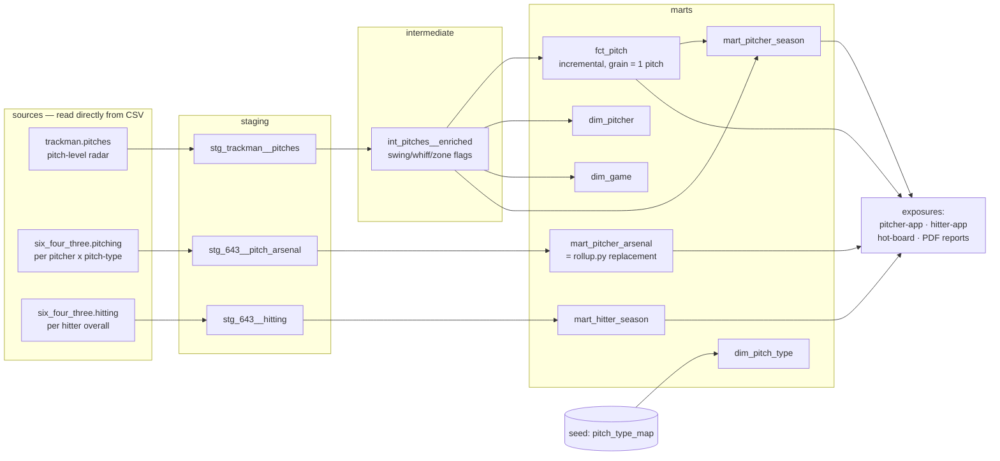

# USD Baseball — dbt analytics warehouse

A tested, documented, incrementally-loaded **dbt** rebuild of the transform /
rollup layer of the USD baseball scouting pipeline.

I run the USD baseball scouting pipeline (SQLite + Python `run.py` rollups,
`INSERT OR REPLACE` upserts, 18 pytest tests). This `warehouse/` rebuilds the
**transform / rollup layer** of that pipeline as a dbt project: source freshness,
model contracts, data-quality tests the Python layer lacked, and full
lineage/docs — over the same real TrackMan + 6-4-3 data. It runs on
[dbt-duckdb](https://github.com/duckdb/dbt-duckdb), so it reads the CSVs directly
with **zero credentials**.

This layer is **purely additive**. It does not modify `run.py`, `src/portal/`,
the Streamlit apps, `db/schema.sql`, or anything else in the repo. Cutover is
staged — `run.py` is unchanged and Trevor flips it to read from the warehouse
when ready (see [MIGRATION.md](MIGRATION.md)).

## Honest scope — what dbt does and does NOT do

dbt owns the **SQL transform / cleaning / rollup / test / mart** layer:

- cast & clean the raw TrackMan and 6-4-3 exports (strip units like `iVB '0.3"'`,
  `'%'`, `'°'`; type the columns; normalize pitch-type labels)
- engineer per-pitch event flags (swing / whiff / strike / in-zone / contact)
- roll the 6-4-3 per-(pitcher, pitch-type) arsenal up into one pitches-weighted
  row per pitcher (the dbt replacement for `src/portal/rollup.py`)
- build conformed dims + a pitch-grain fact + season marts
- enforce model contracts and run data-quality tests

The **ML scoring stays in Python and is out of dbt scope.** The Stuff+ / xWhiff /
xSLG models (joblib / XGBoost / LightGBM, in `pitcher-app/` + `hitter-app/`,
invoked by `src/portal/trackman.py`) run model **inference** that does not belong
in a SQL warehouse. dbt **consumes** 6-4-3's already-computed `Stuff+` /
`Location+` / `xRV+` columns and the raw TrackMan measured fields; it never runs a
model. The pitches-weighted *aggregation* of those scores is dbt's job; producing
the scores is Python's.

## Coaches' notes are intentionally excluded

This warehouse is the **analytics / metrics layer only** — pitches, arsenal,
pitcher / hitter stats. It deliberately does **not** read or expose any of the
private CRM / coaches'-notes data: `call_assignments` (notes, scout_notes,
lead_temp), `board_overlay`, or `board_notes`. None of those tables are a source,
a model, or an exposure dependency here. The hot-board *evaluation* numbers are in
scope; the coaches' private notes on players are not.

## Lineage



## Quickstart

Requires Python 3.10+. Uses [`uv`](https://github.com/astral-sh/uv) (or plain
`pip`). All commands run from this `warehouse/` directory.

```bash
# 1. toolchain into a local venv (gitignored)
uv venv .venv                       # or: python -m venv .venv
uv pip install dbt-core dbt-duckdb  # or: .venv/Scripts/pip install dbt-core dbt-duckdb

# 2. install dbt packages (dbt_utils, dbt_expectations, dbt_date)
dbt deps

# 3. build + test against the committed SAMPLE fixtures (zero setup, zero creds).
#    profiles.example.yml shows the profile; point dbt at it with --profiles-dir .
dbt build --profiles-dir .
```

That last command builds every model and runs every test against the small
sample fixtures under `sample_data/` — green on a fresh public clone with no
data and no credentials.

### Running against the full real data (local)

The full-season exports are gitignored (public-repo hygiene). Locally, point the
source vars at the real CSVs:

```bash
dbt build --profiles-dir . --full-refresh --vars '{
  "trackman_csv": "../pitcher-app/data/raw/usd_baseball_TM_master_file.csv",
  "six43_pitching_csv": "../data/643_exports/pitching/pitchers_2025.csv",
  "six43_hitting_csv": "../data/643_exports/hitters_2025_overall.csv"
}'
```

### Docs & lineage

```bash
dbt docs generate --profiles-dir .
dbt docs serve --profiles-dir .     # interactive DAG + column-level lineage
```

## Layout

```
warehouse/
├── dbt_project.yml          # project config; vars point at sample fixtures by default
├── packages.yml             # dbt_utils + dbt_expectations + dbt_date
├── profiles.example.yml     # duckdb dev + ci targets (copy or use --profiles-dir .)
├── models/
│   ├── staging/             # _sources.yml + stg_* (cast/clean/rename) + tests
│   ├── intermediate/        # int_pitches__enriched (engineered flags)
│   └── marts/               # dims + fct_pitch (incremental) + mart_* + contracts + exposures
├── macros/                  # clean_numeric · pitch_code · name_key · weighted_mean
├── tests/                   # singular DQ + referential + rollup-equivalence tests
├── seeds/                   # pitch_type_map.csv
├── sample_data/             # small committed fixtures so CI runs green publicly
├── MIGRATION.md             # Python transform -> dbt model/macro mapping
└── README.md
```

## Data-quality tests (the value-add over the Python layer)

The Python pipeline has 18 pytest tests but no in-pipeline **data**-quality gates.
This warehouse adds them:

- `assert_pitch_velo_in_range` — a classified pitch must release 50–105 mph.
  On the full 2025 season this surfaces **4 mis-tracked sub-50-mph "pitches"**
  (radar artifacts the Python rollup silently averages in). Configured `warn`
  with a `>10` hard-error escape hatch, so it's loud without blocking the build.
- `assert_no_orphan_pitch_pitcher` — every fact pitch resolves to a `dim_pitcher`.
- `assert_arsenal_rollup_reconciles` — the **migration/equivalence proof**: an
  independent hand re-derivation of the pitches-weighted Stuff+ must equal
  `mart_pitcher_arsenal.stuff_plus` (verified equal to `rollup.py`'s
  `_weighted_mean` to the 0.1 rounding, on real USD pitchers).
- plus `not_null` / `unique` / `accepted_values` / `accepted_range` /
  `relationships` generic tests across staging, dims, the fact, and the marts,
  and **enforced model contracts** on `fct_pitch` + the dims.
```
